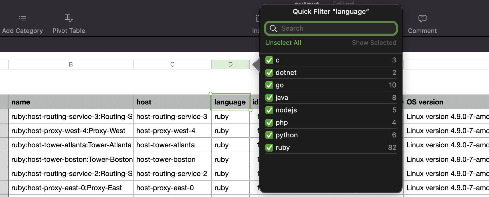

# List all APM Services and their attributes (New Relic version, run time version, etc)

```bash
# clone this repo and install dependencies
npm install

# replace the ACCOUNTID and USERAPIKEY below (from https://one.newrelic.com/api-keys)
ACCOUNTID=xxxx USERAPIKEY=yyyy node . > output.csv

```

